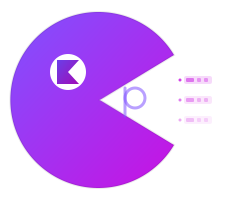

<p align="center">
  
</p>

<h1 align="center">KAP — Kotlin Async Parallelism</h1>

<p align="center">
  <strong>Type-safe multi-service orchestration for Kotlin coroutines.</strong><br>
  Flat chains, visible phases, compiler-checked argument order.<br>
  <em>Your code shape <b>is</b> the execution plan.</em>
</p>

<p align="center">
  <a href="https://github.com/damian-rafael-lattenero/kap/actions/workflows/ci.yml"></a>
  <a href="https://central.sonatype.com/artifact/io.github.damian-rafael-lattenero/kap-core"></a>
  <a href="https://kotlinlang.org"></a>
  <a href="https://github.com/Kotlin/kotlinx.coroutines"></a>
</p>

<p align="center">
  <a href="#benchmarks"></a>
  <a href="https://damian-rafael-lattenero.github.io/kap/benchmarks/"></a>
  <a href="https://www.apache.org/licenses/LICENSE-2.0"></a>
  <a href="#modules"></a>
</p>

<h2 align="center">
  <a href="https://damian-rafael-lattenero.github.io/kap/guide/quickstart/">🚀 Quick Start</a>&nbsp;&nbsp;&nbsp;&nbsp;&nbsp;&nbsp;<a href="https://damian-rafael-lattenero.github.io/kap/">📖 Documentation</a>
</h2>

---

## 11 services. 5 phases. One flat chain.

**Raw Coroutines** — 30 lines, invisible phases, silent bugs:

```kotlin
val checkout = coroutineScope {
    val dUser = async { fetchUser() }
    val dCart = async { fetchCart() }
    val dPromos = async { fetchPromos() }
    val dInventory = async { fetchInventory() }
    val user = dUser.await()          // ← move above async? Silent serialization.
    val cart = dCart.await()           // ← swap with promos? Same type = no compiler error.
    val promos = dPromos.await()
    val inventory = dInventory.await()

    val stock = validateStock()       // Where does phase 1 end? Read every line to find out.

    val dShipping = async { calcShipping() }
    val dTax = async { calcTax() }
    val dDiscounts = async { calcDiscounts() }
    val shipping = dShipping.await()
    val tax = dTax.await()
    val discounts = dDiscounts.await()

    val payment = reservePayment()    // Another invisible barrier.

    val dConfirmation = async { generateConfirmation() }
    val dEmail = async { sendEmail() }

    CheckoutResult(
        user, cart, promos, inventory, stock,
        shipping, tax, discounts, payment,
        dConfirmation.await(), dEmail.await()
    )
}
```

**Arrow** — Better, but nested `parZip` blocks, still no visible phases:

```kotlin
val checkout = parZip(
    { fetchUser() }, { fetchCart() }, { fetchPromos() }, { fetchInventory() },
) { user, cart, promos, inventory ->
    val stock = validateStock()
    parZip(
        { calcShipping() }, { calcTax() }, { calcDiscounts() },
    ) { shipping, tax, discounts ->
        val payment = reservePayment()
        parZip(
            { generateConfirmation() }, { sendEmail() },
        ) { confirmation, email ->
            CheckoutResult(user, cart, promos, inventory, stock,
                shipping, tax, discounts, payment, confirmation, email)
        }
    }
}
```

**KAP** — 12 lines, explicit phases, compile-time safe:

```kotlin
val checkout: CheckoutResult = Async {
    kap(::CheckoutResult)
        .with { fetchUser() }              // ┐
        .with { fetchCart() }               // ├─ phase 1: parallel
        .with { fetchPromos() }             // │
        .with { fetchInventory() }          // ┘
        .then { validateStock() }           // ── phase 2: barrier
        .with { calcShipping() }            // ┐
        .with { calcTax() }                 // ├─ phase 3: parallel
        .with { calcDiscounts() }           // ┘
        .then { reservePayment() }          // ── phase 4: barrier
        .with { generateConfirmation() }    // ┐ phase 5: parallel
        .with { sendEmail() }              // ┘
}
```

**Swap any two `.with` lines → compile error.** 130ms total vs 460ms sequential.

---

## Value-dependent phases with `.andThen`

When phase 2 **needs** phase 1's results:

```kotlin
val dashboard: FinalDashboard = Async {
    kap(::UserContext)
        .with { fetchProfile(userId) }       // ┐
        .with { fetchPreferences(userId) }   // ├─ phase 1: parallel
        .with { fetchLoyaltyTier(userId) }   // ┘
        .andThen { ctx ->                    // ── barrier: ctx available
            kap(::EnrichedContent)
                .with { fetchRecommendations(ctx.profile) }  // ┐
                .with { fetchPromotions(ctx.tier) }           // ├─ phase 2: parallel
                .with { fetchTrending(ctx.prefs) }            // │
                .with { fetchHistory(ctx.profile) }           // ┘
                .andThen { enriched ->                         // ── barrier
                    kap(::FinalDashboard)
                        .with { renderLayout(ctx, enriched) }     // ┐ phase 3
                        .with { trackAnalytics(ctx, enriched) }   // ┘
                }
        }
}
```

14 calls, 3 phases, **115ms vs 460ms sequential**. The dependency graph **is** the code shape.

---

## Install

```kotlin
dependencies {
    implementation("io.github.damian-rafael-lattenero:kap-core:2.3.0")

    // Optional
    implementation("io.github.damian-rafael-lattenero:kap-resilience:2.3.0")  // Schedule, CircuitBreaker, Resource, timeoutRace
    implementation("io.github.damian-rafael-lattenero:kap-arrow:2.3.0")       // Parallel validation with error accumulation
    implementation("io.github.damian-rafael-lattenero:kap-ktor:2.3.0")        // Ktor server plugin
    testImplementation("io.github.damian-rafael-lattenero:kap-kotest:2.3.0")  // Test matchers
}
```

## Benchmarks

| Dimension | Raw Coroutines | Arrow | KAP |
|---|---|---|---|
| **Framework overhead** (arity 3) | <0.01ms | 0.02ms | **<0.01ms** |
| **Multi-phase** (9 calls, 4 phases) | 180.85ms | 181.06ms | **180.98ms** |
| **timeoutRace** (primary wins) | 180.55ms | — | **30.34ms** |
| **Max validation arity** | — | 9 | **22** |

[Live benchmark dashboard](https://damian-rafael-lattenero.github.io/kap/benchmarks/) · All claims backed by **119 JMH benchmarks** and deterministic virtual-time proofs.

---

<h2 align="center">
  <a href="https://damian-rafael-lattenero.github.io/kap/guide/quickstart/">🚀 Quick Start</a>&nbsp;&nbsp;&nbsp;&nbsp;&nbsp;&nbsp;<a href="https://damian-rafael-lattenero.github.io/kap/">📖 Full Documentation</a>
</h2>

## License

Apache 2.0
